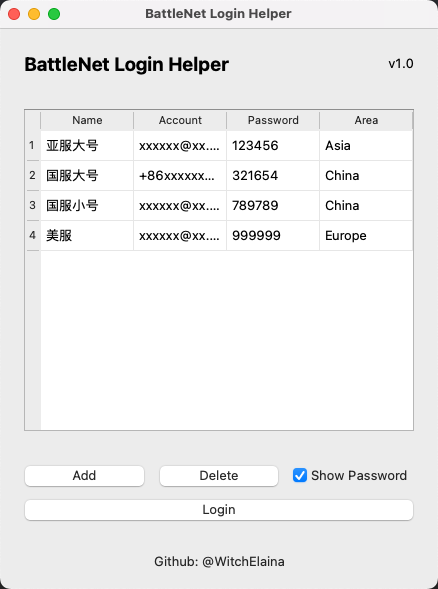
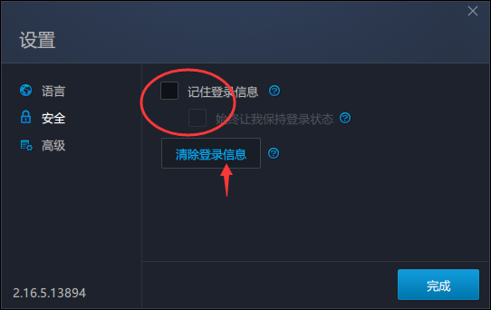

# BattleNet-Login-Helper

战网多账号管理与自动登录助手，支持Windows/macOS



## 功能

- 存储账号信息, 包括账号密码与登录信息
- 一键登录选中账号至对应地区战网

## 使用

### 准备工作

#### 设置（可选）



在战网登录界面的设置中取消勾选记住登录信息和始终让我保持登录状态，点击清楚登录信息，点击完成并重启战网

#### 获取程序

以下两种方法二选一即可

##### 应用程序

直接前往Release界面下载对应系统版本即可。


##### 源码运行

需要安装`python`, 推荐使用`3.10.8`

```shell
# 克隆源码并安装依赖
git clone https://github.com/WitchElaina/BattleNet-Login-Helper.git
cd BattleNet-Login-Helper
pip install -r requirements.txt

# 运行程序
python main.py
```

> ps.针对Windows提供了一个快速启动的脚本，双击执行`run.bat`即可

### 使用说明

#### 账号管理

启动后点击Add添加账号，选中账号并点击delete删除账号，在单元格中双击可以修改账号信息。

#### 自动登录

打开战网，打开本程序并选中想要登录的账号（单击任意单元格，观察到蓝色高亮即可），点击login按钮随后迅速切换到战网窗口，点击一下输入账号的文本框等待即可。


## 声明

程序数据均为本地存储, 理论上不会泄露您的账号信息

请勿从本文档提供的方式外下载安装使用本程序

如您使用本程序后发现账号丢失等问题, 本人**概不负责**

**运行本程序即代表您同意本声明中所有事项**


## 原理

本程序实际上就是一个按键精灵，利用模拟键鼠操作完成账号密码的输入与登陆按钮的点击


## 贡献

欢迎提交代码，正常提交pull request即可。
